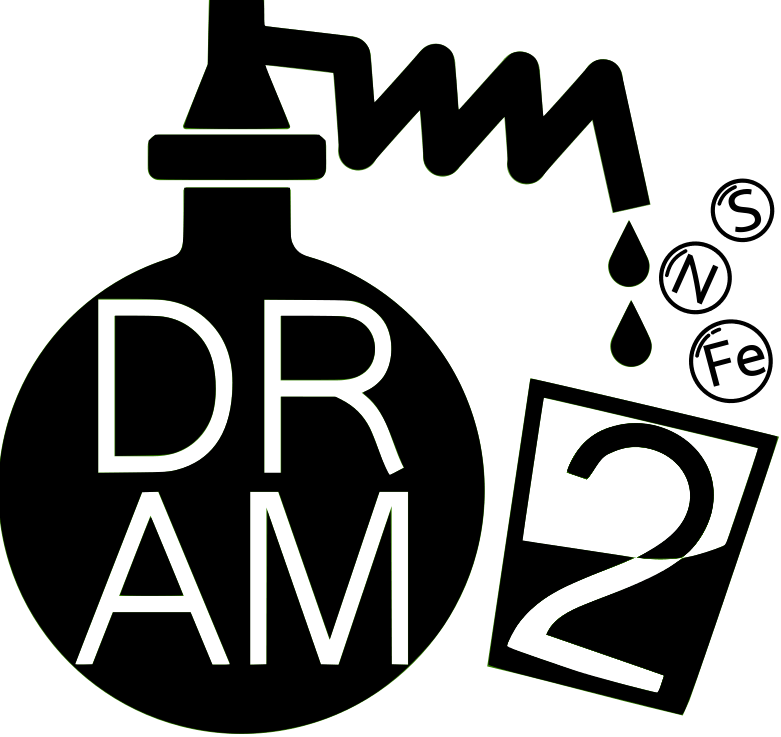

# DRAM2

### Welcome to the wiki for Distilled and Refined Annotation of Metabolism 2 (DRAM2)!

Here you will find give you basic instructions for running DRAM2, but for full documentation, please see the official DRAM2 webpage: [Read-the-docs](https://dramit.readthedocs.io/en/latest)

<p align="center">
 
</p>

## ⚠️ DRAM2 is currently under active development and usage is at your own risk. ⚠️

DRAM1 can currently still be found [in the master branch](https://github.com/BortonWrightonLabs/DRAM/tree/master) for now. 

## DRAM2 Overview
DRAM2 (Distilling and Refining Annotations of Metabolism, version 2) is a tool for annotating genomic and metagenomic assemblies (e.g., scaffolds or contigs) as well as predicted genes (nucleotide or amino acid sequences). It organizes genome annotations into metabolic functions across three levels of increasing interpretation: (1) **ANNOTATE**, (2) **SUMMARIZE**, and (3) **VISUALIZE**. This workflow enables the analysis of large numbers of microbial genomes or metagenomes, highlighting functional guilds and supporting inference of organismal metabolism across datasets.

During the **ANNOTATE** stage, DRAM2 identifies genes in input sequences and annotates them using multiple databases, including [KEGG](https://www.kegg.jp/) (if provided by the user), [UniRef90](https://www.uniprot.org/), [PFAM](https://pfam.xfam.org/), [dbCAN3](http://bcb.unl.edu/dbCAN2/), [RefSeq Viral](https://www.ncbi.nlm.nih.gov/genome/viruses/), [VOGDB](http://vogdb.org/), [MEROPS](https://www.ebi.ac.uk/merops/), and optional user-defined databases. A full list of available annotation databases can be found here: [BortonWrightonLabs/dram pipeline parameters](https://dramit.readthedocs.io/en/latest/params_doc.html#pipeline-steps). ANNOTATE then integrates results across all databases, increasing annotation coverage and yielding ~25% more database hits than commonly used annotators such as DFAST, MetaERG, and Prokka.

The **ANNOTATE** output contains all database hits for every gene in each genome, generating a comprehensive output of most annotation pipelines. DRAM2 extends beyond this by organizing (**SUMMARIZE**) and visualizing (**VISUALIZE**) annotations into ecosystem-relevant functional categories, enabling more interpretable comparisons across genomes and ecosystems.

## Basic usage: 
Below is an example of basic DRAM2 usage. This code is for annotating a directory of genomes, renaming them for downstream use, calling genes and annotating them using all available databases, performing quality control, summarizing and visualizing with particular ecosystems in mind and assigning genome-level traits to the organisms. The command is submitted on the command line and will run in the background. 


``` bash
nextflow run BortonWrightonLabs/DRAM --input_fasta [INPUT_FASTA] --outdir [OUTPUT_DIR] --rename --annotate --anno_dbs all --qc --summarize --sum_ecos 'eng_sys,ag' --visualize --traits -profile singularity -resume --slurm -bg
```
Please note that '--input_fasta [INPUT_FASTA]' should be a directory of genomes or MAGs in .fa or .fna format. It is also worth noting that all Nextflow options are specified with a single dash `-`, while all DRAM2-specific options are specified with a double dash `--`.  All available Nextflow options can be seen by running:

`nextflow run -help`

## Quick Links
- [Docs](https://dramit.readthedocs.io/en/latest)
- [Installation Guide](https://dramit.readthedocs.io/en/latest/installation.html)
- [Usage Examples](https://dramit.readthedocs.io/en/latest/usage.html)
- [Parameter API](https://dramit.readthedocs.io/en/latest/params_doc.html#pipeline-steps)
- [Rules API](https://dramit.readthedocs.io/en/latest/rules_parser.html)


## Other DRAM products from our research group:
- [DRAM webinar](https://www.youtube.com/watch?v=-Ky2fz2vw2s)
- [DRAM in KBase publication (2023)](https://pubmed.ncbi.nlm.nih.gov/36857575/)


## Citing DRAM
If DRAM helps you in your research, please cite:
[DRAM publication in Nucleic Acids Research (2020)](https://academic.oup.com/nar/article/48/16/8883/5884738)
