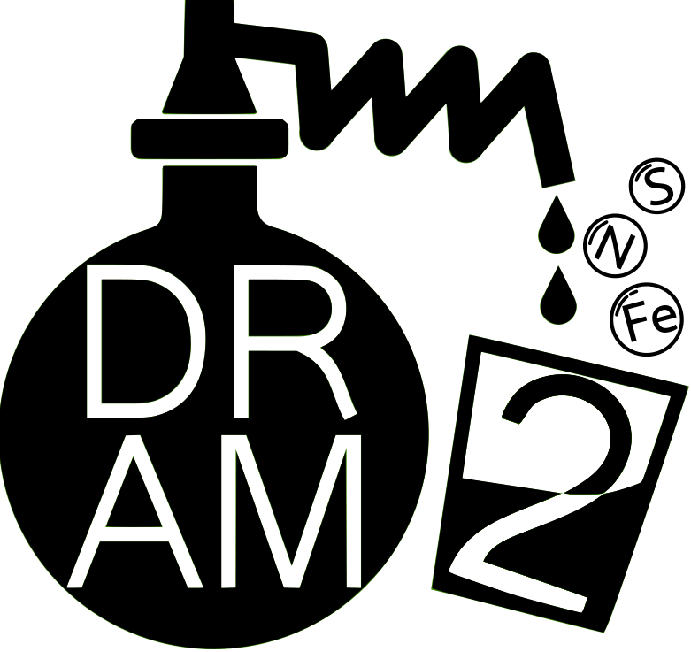

<p align="center">
  
</p>

<h1 align="center">
  <strong> ⚠️ DRAM2 is currently under active development and usage is at your own risk. ⚠️ </strong></br>
</h1>


DRAM2 (Distilled and Refined Annotation of Metabolism Version 2) is a tool for annotating metagenomic assembled genomes. DRAM2 annotates MAGs using [KEGG](https://www.kegg.jp/) (if provided by the user), [UniRef90](https://www.uniprot.org/), [PFAM](https://pfam.xfam.org/), [dbCAN](http://bcb.unl.edu/dbCAN2/), [RefSeq viral](https://www.ncbi.nlm.nih.gov/genome/viruses/), [VOGDB](http://vogdb.org/) and the [MEROPS](https://www.ebi.ac.uk/merops/) peptidase database as well as custom user databases. DRAM is run in two stages. First an annotation step to assign database identifiers to gene, and then a distill step to curate these annotations into useful functional categories. DRAM2 was implemented in [Nextflow](https://www.nextflow.io/) due to its innate scalability on HPCs and containerization, ensuring rigorous reproducibility and version control, thus making it ideally suited for high-performance computing environments. 

For more detail on DRAM and how DRAM works please see our [paper](https://academic.oup.com/nar/article/48/16/8883/5884738) as well as the [wiki](https://github.com/WrightonLabCSU/DRAM/wiki).

### DRAM2 Development Note

The DRAM development team is actively working on DRAM2. We do not anticipate adding any additional functionality to DRAM, i.e. DRAM1.
- Future updates will include:
  - Both support for Nextflow + Conda and Nextflow + Singularity (Note: Singularity is not well-supported for MAC.).
  - Pre-formatted annotation and description databases avaiable via (GLOBUS)[https://www.globus.org/].

 
----------

## Quick links
- [Installation](#install)
- [Databases](#databases)
- [Example command-line usage](#exampleusage)
- [All command-line options](#options)
- [Software versions](#software)
- [Cool Nextflow Tips and Tricks](#tipsandtricks)
- [System Requirements](#systemrequirements)
  
----------

<a name="install"></a>
### Installation
1) Clone the DRAM2 GitHub Repository
2) Download Singularity container and pre-formatted databases
2) [Install Nextflow >= v23.04.2.5870](https://www.nextflow.io/docs/latest/getstarted.html)
3) [Install Singularity >= v3.7.0](https://docs.sylabs.io/guides/3.0/user-guide/installation.html) (to pull Singualrity images from SyLabs).

#### General Instructions:
```
git clone https://github.com/WrightonLabCSU/DRAM2.git
cd COMET
./pull_singularity_containers.py
./pull_databases_full.py
```

#### Note for use on HPC:
- DRAM2 has SLURM auto submission integrated into the pipeline.
  - To use this feature, ensure you have [SLURM](https://slurm.schedmd.com/quickstart_admin.html) on your cluster.
- **If you do not have SLURM and do not want to use SLURM, use the provided alternative config file: `nextflow-No-SLURM.config`.**
  - **To use this config, you need to add the following to your command: `-c nextflow-No-SLURM.config`.**

---------
<a name="databases"></a>
### DRAM2 Databases
DRAM2 databases, unlike DRAM1 databases, will be pre-formatted and hosted online. Users of DRAM2 will need to 1) decide which databases suits their needs and 2) download DRAM2 databases via the provided `pull_databases_*.py scripts. However, these databases can be quite large and it is therefore important to look through the options below.

These databases rely on an SQL database of database descriptions which is provided in 3 different sizes based on ther user's needs.

#### All databases DRAM2 accommodates:
- [KEGG](https://www.genome.jp/kegg/)
    - Kyoto Encyclopedia of Genes and Genomes.
    - (140G)
- [dbCAN](http://bcb.unl.edu/dbCAN2/)
    - A database for automated carbohydrate-active enzyme annotation.
    - (202M)
- [Kofam](https://www.genome.jp/tools/kofamkoala/)
    - Customized HMM database of KEGG Orthologs (KOs).
    - (14G)
- [MEROPS](https://www.ebi.ac.uk/merops/)
    - A database of proteolytic enzymes and their substrates.
    - (3.6G)
- [Viral](https://www.ncbi.nlm.nih.gov/genomes/GenomesGroup.cgi?taxid=10239)
    - RefSeq viral database.
    - (1.6G)
- [CAMPER](https://github.com/WrightonLabCSU/CAMPER)
    - Curated Annotations for Microbial (Poly)phenol Enzymes and Reactions.
    - (846M)
- [CANT-HYD](https://github.com/dgittins/CANT-HYD-HydrocarbonBiodegradation)
    - Curated database of phylogeny-derived hidden markov models for annotation of marker genes involved in hydrocarbon degradation.
    - (877M)
- [FeGenie](https://github.com/Arkadiy-Garber/FeGenie)
    - Placeholder description.
    - (6.6M)
- [Sulfur](url_to_sulfur_placeholder)
    - Custom Sulfur database.
    - (1.7M)
- [Methyl](url_to_methyl_placeholder)
    - Hidden Markov models (HMMs) based on genes related to iron acquisition, storage, and reduction/oxidation in Bacteria and Archaea.
    - (52K)
- [UniRef](https://www.uniprot.org/help/uniref)
    - A comprehensive and non-redundant database of protein sequences.
    - (477G)
- [Pfam](https://pfam.xfam.org/)
    - A large collection of protein families, each represented by multiple sequence alignments and hidden Markov models (HMMs).
    - (8.8G)
- [VOGDB](url_to_vogdb_placeholder)
    - Placeholder description.
    - (4.5G)

#### DRAM2 Database (sets)
**Big set**
- Includes all medium databases + UniRef 
- Excludes KEGG*
- 
`./pull_databases_full.py`
OR
Follow these instructions to pull manually via [GLOBUS](https://www.globus.org/).

**Routine Set**
- Includes: dbCAN, Kofam, MEROPS, Viral, CAMPER, CANT-HYD, FeGenie, Sulfur, Methyl, Pfam, VOGDB
- Excludes KEGG*
- Excludes UniRef
  
`./pull_databases_routine.py`
OR
Follow these instructions to pull manually via [GLOBUS](https://www.globus.org/).

**Minimal Set** 
- Includes: <TBD>

`./pull_databases_minimal.py`
OR
Follow these instructions to pull manually via [GLOBUS](https://www.globus.org/).

##### KEGG download and format
A [subscription](https://www.kegg.jp/kegg/download/) is required to download the [kegg](https://www.genome.jp/kegg/) database.
If you have a subscription and would like to use KEGG you will need to 1) download the KEGG <blank> file, 2) run the `format-KEGG-DRAM2.py script` to format the KEGG database for DRAM2 and 3) place the formatted database files in the appropriate location.

[Download](https://www.kegg.jp/kegg/download/) the amino acid FASTA file (`*.pep`) downloaded from KEGG. This can be any of the gene fasta files that are provided by the KEGG FTP server or a concatenated version of them. 

Run the `format-KEGG-DRAM2.sh` script:
`./format-KEGG-DRAM2.py <path-to-downloaded-kegg.pep>`

--------

#### DRAM2 Descriptions Database
**Big set**
- Includes Uniref and KEGG
`./pull_descriptions_full.py`
OR
Follow these instructions to pull manually via (GLOBUS)[https://www.globus.org/].

**Routine Set**
- Excludes Uniref and KEGG
`./pull_descriptions_routine.py`
OR
Follow these instructions to pull manually via (GLOBUS)[https://www.globus.org/].

--------

<a name="exampleusage"></a>
### Example usage

DRAM2 apps Call, Annotate and Distill can all be run at once or alternatively, each app can be run individualy (assuming you provide the required input data for each app).

1) **Call genes using input fastas (use --rename to rename FASTA headers):**

`nextflow run DRAM2.nf --call --rename --input_fasta_dir <path/to/fasta/directory/>`

    
2) **Annotate called genes using input called genes and the KOFAM database:**

`nextflow run DRAM2.nf --annotate --input_genes <path/to/called/genes/directory> --use_kofam`


3) **Annotate called genes using input fasta files and the KOFAM database:**

`nextflow run DRAM2.nf --annotate --input_fasta <path/to/called/genes/directory> --use_kofam`


4) **Distill using input annotations:**

`nextflow run DRAM2.nf --distill_<topic|ecosystem|custom> --annotations <path/to/annotations.tsv>`


5) **(Combined): Call, annotate and distill input fasta files:**

`nextflow run DRAM2.nf --rename --call --annotate --use_<database(s) --distill_topic <distillate(s)>`


6) **Call and Annotate genes using input fastas and KOFAM database. Distill using the default topic and AG ecosystem:**

      ```nextflow run DRAM2.nf --input_fasta_dir <path/to/fasta/directory/> --outdir <path/to/output/directory/> --call --annotate --distill_topic default --distill_ecosystem ag --threads <threads> --        use_kofam```


-------

<a name="options"></a>
### Command-line Options

#### General Help Menu
    Description: 
        The purpose of DRAM2 is to provide FASTA annotation, across a vast array of databases, with expertly-currated distillation. 
        DRAM2 can be used to call, annotate and distill annotations from input FASTA files. 
        Call, annotate and distill can be run together or, each can be run idependently. 

    Bring up help menu:
        nextflow run DRAM2.nf --help (--h)

    Bring up versions menu:
        nextflow run DRAM2.nf --version (--v)      

    Usage:
        nextflow run DRAM2.nf --rename --call --annotate --use_<database(s) --distill_topic <distillate(s)>

        Call genes using input fastas (use --rename to rename FASTA headers):
            nextflow run DRAM2.nf --call --rename --input_fasta_dir <path/to/fasta/directory/>

        Annotate called genes using input fastas:
            nextflow run DRAM2.nf --annotate --input_genes <path/to/called/genes/directory>

        Distill using input annotations:
            nextflow run DRAM2.nf --distill_<topic|ecosystem|custom> --annotations <path/to/annotations.tsv>

        (Combined): Call, annotate and distill input fasta files:
            nextflow run DRAM2.nf --rename --call --annotate --use_<database(s) --distill_topic <distillate(s)> 

        (Real) example: (on multiple lines for clarity)
        nextflow run DRAM2.nf --input_fasta ../test_data/ 
            --outdir DRAM2-test-data-Feb012024/ 
            --call --rename 
            --annotate --use_uniref --use_kegg --use_merops --use_viral --use_camper --use_kofam --use_dbcan --use_methyl --use_canthyd --use_vog --use_fegenie --use_sulfur 
            --add_annotations ../test-data/old-DRAM-annotations.tsv
            --distill_topic 'carbon transport energy' --distill_ecosystem 'eng_sys ag' 
            --distill_custom assets/forms/distill_sheets/test.tsv -resume --slurm_node zenith 
            --trnas ../test-data/trnas.tsv
            --rrnas ../test-data/rrnas.tsv
            --bin_quality ../test-data/checkM1-test-data.tsv
            --taxa ../test-data/gtdbtk.bac120.summary.tsv
            --threads 5
            -with-report -with-trace -with-timeline

    Main DRAM2 Operations:
        --call      : Call genes using prodigal 
        --annotate  : Annotate called genes using downloaded databases
        --distill   : Distill the annotations into a multi-sheet distillate.xlsx

    Call options:
        --call                  OPTION  Call genes on the input FASTA files using Prodigal.

        --input_fasta           PATH    <path/to/fasta/directory/>
                                            Directory containing input fasta files.      
                                            Default: <./input_fasta/*.fa*>

        --rename                OPTION  Rename FASTA headers based on file name.    
                                            Example: sample1.fa --> (fasta header renamed to) > sample1......
                                            Why? DRAM2 output is focused on scaffolds/contigs with respect to each provided input sample.
                                                Thus, without renaming FASTA headers, the individual scaffolds/contigs will not be distinguashable.
                                                *If you have already renamed your FASTA headers, do not include '--call'.

        --prodigal_mode         STRING  <single|meta>
                                            Default: 'single'

        --prodigal_tras_table   NUMBER  (1,2,3,4,5,6,7,8,9,10,11,12,13,14,15,16,17,18,19,20,21,22,23,24,25)
                                            Specify a translation table to use (default: '1').

    Annotate options:
        --use_<db-name>         STRING   <camper|cant_hyd|dbcan|fegenie|kegg|kofam|merops|methyl|heme|pfam|sulfur|uniref]
                                            Specify databases to use. Can use more than one. Can be used in combination with --use_dbset.
        
        --use_dbset             STRING  <metabolism_kegg_set|metabolism_set|adjectives_kegg_set|adjectivs set>
                                            metabolism_kegg_set = kegg, dbcan, merops, pfam, heme
                                            metabolism_set      = kofam, dbcan, merops, pfam, heme
                                            adjectives_kegg_set = kegg, dbcan, merops, pfam, heme, sulfur, camper, methyl, fegenie
                                            adjectives_set      = kofam, dbcan, merops, pfam, heme, sulfur, camper, methyl, fegenie
                                            *Only one set can be used. Can be used in combination with --use_[db-name]
        
        --input_genes           PATH    <path/to/called/genes/directory/>
                                            Directory containing called genes (.faa) 

        --add_annotations       PATH    <path/to/old-annoations.tsv> 
                                            Used to add in old annotations to the current run. (See example for format.)

    Distill options:
        --annotations           PATH     <path/to/annotations.tsv>
                                            Required if you are running distill without --call and --annotate.

        --rrnas                 PATH    <path/to/rRNA.tsv> (See example for format.)
                                            rRNA information will be included in distill output.

        --trnas                 PATH    <path/to/tRNA.tsv> (See example for format.)
                                            tRNA information will be included in distill output.
        
        --bin_quality           PATH    <path/to/bin-quality.tsv> (See example for format.)
                                            CheckM and CheckM2 compatible. 

        --taxa                  PATH    <path/to/bin-taxonomy.tsv>
                                            Compatible with GTDB. (See example for format.)

        --distill_topic         STRING  <carbon|energy|misc|nitrogen|transport> OR <default = carbon, energy, misc, nitrogen, transport>
                                            If more than one topic included, they must be enclosed in single quotes

        --distill_ecosystem     STRING  <eng_sys|ag>
                                            If more than one ecosystem included, they must be enclosed in single quotes

        --distill_custom        STRING  <path/to/custom_distillate.tsv> (See example for format and options.)
                                            As of now, only one custom distillate may be included.

    General options:
        --outdir                PATH    <path/to/output/directory>
                                            Default: './DRAM2_output/'

        --threads               NUMBER  Number of threads to use for processing.
                                        Default: '10'

#### Call Help Menu
    Call description: The purpose of DRAM2 --call is to call genes on input FASTA files.

    Usage:

        Call genes using input fastas:
            nextflow run DRAM2.nf --call --input_fasta_dir <path/to/fasta/directory/> --outdir <path/to/output/directory/> --threads <threads>

    Call options:
        --rename                Rename FASTA headers based on file name.    
                                    Example: sample1.fa --> (fasta header renamed to) > sample1......
                                    Why? DRAM2 output is focused on scaffolds/contigs with respect to each provided input sample.
                                        Thus, without renaming FASTA headers, the individual scaffolds/contigs will not be distinguashable.
                                        *If you have already renamed your FASTA headers, do not include '--call'.

        --prodigal_mode         STRING  <single|meta>
                                    Default: 'single'

        --prodigal_tras_table   <1|2|3|4|5|6|7|8|9|10|11|12|13|14|15|16|17|18|19|20|21|22|23|24|25>
                                    Specify a translation table to use (default: '1').

    Main options:
        --input_fasta           PATH    <path/to/fasta/directory/>
                                        Directory containing input fasta files.      
                                        Default: './input_fasta/'

        --outdir                PATH    <path/to/output/directory>
                                            Default: './DRAM2_output/'

        --threads               NUMBER  Number of threads to use for processing.
                                        Default: '10'

#### Annotate Help Menu
    Annotate description: The purpose of DRAM2 '--annotate' is to annotate called genes on input (nucleotide) FASTA (fa*) files.

    Usage:

        Annotate called genes using input called genes and the KOFAM database:
            nextflow run DRAM2.nf --annotate --input_genes <path/to/called/genes/directory> --use_kofam
        
        Annotate called genes using input fasta files and the KOFAM database:
            nextflow run DRAM2.nf --annotate --input_fasta <path/to/called/genes/directory> --use_kofam

    Annotate options:
    --use_<db-name>         STRING   <camper|cant_hyd|dbcan|fegenie|kegg|kofam|merops|methyl|heme|pfam|sulfur|uniref]
                                        Specify databases to use. Can use more than one. Can be used in combination with --use_dbset.
    
    --use_dbset             STRING  <metabolism_kegg_set|metabolism_set|adjectives_kegg_set|adjectivs set>
                                        metabolism_kegg_set = kegg, dbcan, merops, pfam, heme
                                        metabolism_set      = kofam, dbcan, merops, pfam, heme
                                        adjectives_kegg_set = kegg, dbcan, merops, pfam, heme, sulfur, camper, methyl, fegenie
                                        adjectives_set      = kofam, dbcan, merops, pfam, heme, sulfur, camper, methyl, fegenie
                                        *Only one set can be used. Can be used in combination with --use_[db-name]
    
    --add_annotations       PATH    <path/to/old-annoations.tsv> 
                                        Used to add in old annotations to the current run. (See example for format.)

    Main options:
    --input_fasta           PATH    <path/to/fasta/directory/>
                                        Directory containing input fasta files.      
                                        Default: './input_fasta/' 
                                        Either '--input_fasta' or '--input_genes' may be used - not both.

    --input_genes           PATH    <path/to/called/genes/directory/>
                                        Directory containing called genes (.fna)
                                        Either '--input_fasta' or '--input_genes' may be used - not both.

    --outdir                PATH    <path/to/output/directory/>
                                        Default: './DRAM2_output/'

    --threads               NUMBER  Number of threads to use for processing.
                                        Default '10'


#### Distill Help Menu

    Distill description:    The purpose of DRAM2 --distill is to distill down annotations based on curated distillation summary form(s). 
                            User's may also provide a custom distillate via --distill_custom <path/to/file> (TSV forms).
                            Distill can be ran independent of --call and --annotate however, annotations must be provided (--annotations <path/to/annotations.tsv>). 
                            Optional tRNA, rRNA and bin quality may also be provided.
    
    Usage:
        nextflow run DRAM2.nf --distill_<topic|ecosystem|custom> --annotations <path/to/annotations.tsv> --outdir <path/to/output/directory/> --threads <threads>
        *Important: if more than one topic or ecosystem is included, they must be enclosed in single quotes. Example: --distill_topic 'carbon transport'
    
    Example:
        Call and Annotate genes using input fastas and KOFAM database. Distill using carbon topic and AG ecosystem:
            nextflow run DRAM2.nf --input_fasta_dir <path/to/fasta/directory/> --outdir <path/to/output/directory/> --call --annotate --distill_topic carbon --distill_ecosystem ag --threads <threads> --use_kofam

    Distill options:
        --annotations           PATH     <path/to/annotations.tsv>
                                            Required if you are running distill without --call and --annotate.

        --rrnas                 PATH    <path/to/rRNA.tsv> (See example for format.)
                                            rRNA information will be included in distill output.

        --trnas                 PATH    <path/to/tRNA.tsv> (See example for format.)
                                            tRNA information will be included in distill output.

        --bin_quality           PATH    <path/to/bin-quality.tsv> (See example for format.)
                                            CheckM and CheckM2 compatible. 

        --taxa                  PATH    <path/to/bin-taxonomy.tsv>
                                        Compatible with GTDB. (See example for format.)

        --distill_topic         STRING  <carbon|energy|misc|nitrogen|transport> OR <default = carbon, energy, misc, nitrogen, transport>
                                            If more than one topic included, they must be enclosed in single quotes

        --distill_ecosystem     STRING  <eng_sys|ag>
                                            If more than one ecosystem included, they must be enclosed in single quotes

        --distill_custom        STRING  <path/to/custom_distillate.tsv> (See example for format and options.)
                                            As of now, only one custom distillate may be included.

    Main options:                
        --outdir                PATH    <path/to/output/directory/>
                                            Default: './DRAM2_output/'

        --threads               NUMBER  Number of threads to use for processing.
                                            Default '10'

-----------

<a name="software"></a>
### Software Used

- **BBTools** [v39.01](https://jgi.doe.gov/data-and-tools/bbtools/)
- **Bowtie2** [v2.5.1](http://bowtie-bio.sourceforge.net/bowtie2/index.shtml)
- **Prodigal** [v2.6.3](https://github.com/hyattpd/Prodigal)
- **Python** [v3.10](https://www.python.org/downloads/release/python-3100/)
- **Pandas** [v1.5.2](https://pandas.pydata.org/pandas-docs/version/1.5.2/)
- **Pytest** [v7.2.0](https://docs.pytest.org/en/7.2.x/)
- **Scikit-bio** [v0.5.7](http://scikit-bio.org/)
- **MMseqs2** [v14.7e284](https://github.com/soedinglab/MMseqs2)
- **HMMER** [v3.3.2](http://hmmer.org/)
- **SciPy** [v1.8.1](https://www.scipy.org/)
- **SQLAlchemy** [v1.4.46](https://www.sqlalchemy.org/)
- **Barrnap** [v0.9](https://github.com/tseemann/barrnap)
- **Altair** [v4.2.0](https://altair-viz.github.io/)
- **OpenPyXL** [v3.0.10](https://openpyxl.readthedocs.io/en/stable/)
- **NetworkX** [v2.8.8](https://networkx.org/)
- **Ruby** [v3.1.2](https://www.ruby-lang.org/en/downloads/)
- **GNU Parallel** [v20221122](https://www.gnu.org/software/parallel/)
- **tRNAscan-SE** [v2.0.12](http://lowelab.ucsc.edu/tRNAscan-SE/)
- **Samtools** [v1.17](http://www.htslib.org/)
- **CD-HIT** [v4.6](http://weizhong-lab.ucsd.edu/cd-hit/)
- **CoverM** [v0.6.1](https://github.com/wwood/CoverM)
- **Subread** [v2.0.6](http://subread.sourceforge.net/)
- **XlsxWriter** [v3.1.6](https://xlsxwriter.readthedocs.io/)
- **Numpy** [v1.26.0](https://numpy.org/)

------

<a name="tipsandtricks"></a>
### Nextflow Tips and Tricks

In Nextflow DSL2, the `-resume` option offers a powerful feature that allows you to efficiently manage and modify your workflow runs. It enables you to resume a run after it has finished, make changes to parameters, and reuse previously generated data, enhancing the flexibility and reusability of your workflow. Here are some common scenarios where the `-resume` option comes in handy:

- **I Want to Run Again with a Different Assembler**
  - By using the `-resume` option, if you have not deleted your `work/` directory, running your previous command with the desired changes will allow you to use your quality-controlled reads from your previous run.
  - For example, if you intially used `--assembler megahit`, you can re-assemble using MetaSPAdes by using instead, `--assembler metaspades`. This will reuse the quality controlled (trimmed) reads stored in the `work/` directory.

- **I Want to Run Again but This Time with a Different Read Mapping Percentage Identity**
  - Similar to the previous scenario, with the `-resume` option, if you have not deleted your `work/` directory, running your previous command with the desired changes will enable you to reuse your QC'd reads and their assemblies from the previous run.
  - For example, if you initally used the default mapping % (`bin_min_id_filter 0.99`) but you want to re-map using a different %, you can change your command to `--bin_min_id_filter 0.95`. This will enable you to reuse your trimmed reads and previous assemblies - the pipeline will pickup at the mapping stage. 

- **I Want to Lower My Completeness and Contamination Values**
  - For this scenario, you have two options:
    1) Examine the checkm2 logs and identify the bins you are interested in within the `all_metabat_bins/` output directory.
    2) Use the `-resume` option to your advantage. If you have not deleted your `work/` directory, running your previous command with the desired changes will allow you to reuse your QC'd reads and their assemblies from the previous run.

These Nextflow tips and tricks demonstrate how the `-resume` option can optimize your workflow, save time, and improve the reusability of previously computed data.


--------

<a name="systemrequirements"></a>
## System Requirements
**EDIT**


*NOTE:* Setting up DRAM can take a long time (up to 5 hours) and uses a large amount of memory (512 gb) by default. To
use less memory you can use the `--skip_uniref` flag which will reduce memory usage to ~64 gb if you do not provide KEGG
 Genes and 128 gb if you do. Depending on the number of processors which you tell  it to use (using the `--threads`
argument) and the speed of your internet connection. On a less than 5 year old server with 10 processors it takes about
 2 hours to process the data when databases do not need to be downloaded.


DRAM has a large memory burden and is designed to be run on high performance computers. DRAM annotates against a large
variety of databases which must be processed and stored. Setting up DRAM with KEGG Genes and UniRef90 will take up ~500
GB of storage after processing and require ~512 GB of RAM while using KOfam and skipping UniRef90 will mean all
processed databases will take up ~30 GB of disk and will only use ~128 GB of RAM while processing. DRAM annotation
memory usage depends on the databases used. When annotating with UniRef90, around 220 GB of RAM is required. If the KEGG
gene database has been provided and UniRef90 is not used, then memory usage is around 100 GB of RAM. If KOfam is used to
annotate KEGG and UniRef90 is not used, then less than 50 GB of RAM is required. DRAM can be run with any number of
processors on a single node.

## Citing DRAM
The DRAM was published in Nucleic Acids Research in 2020 and is available [here](https://academic.oup.com/nar/article/48/16/8883/5884738). If
DRAM helps you out in your research, please cite it.


