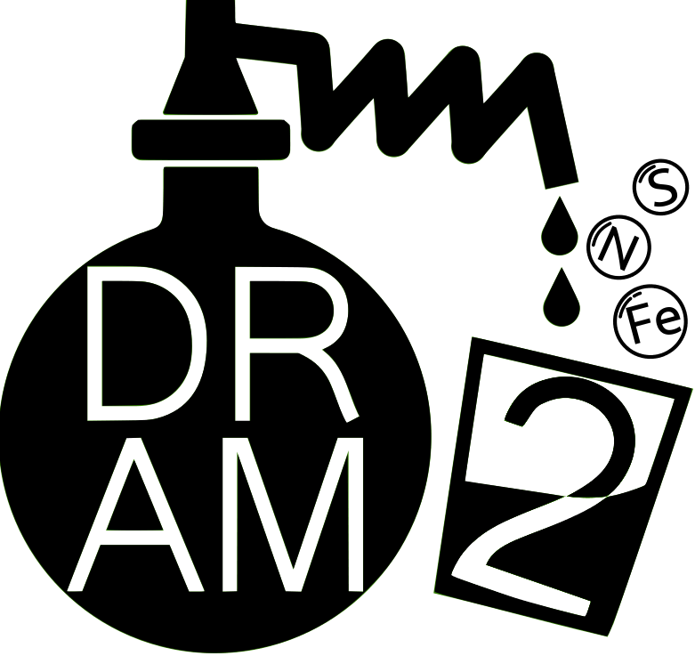

# DRAM2 Visualization Library

This directory contains the visualization code for DRAM2. The visualization code is written in Python and uses the [Bokeh](https://bokeh.org) and [Panel](https://panel.holoviz.org) libraries. The visualization code is used to generate the figures 
and dashboards for the [DRAM2 gene annotation tool](https://github.com/WrightonLabCSU/DRAM2).

## Nextflow Integration

The DRAM2 Visualization Library can be integrated into the DRAM2 Nextflow pipeline to generate figures in the form of html files. The html files can be viewed in a web browser and can be used to explore the results of the DRAM2 gene annotation software. This can be incorporated into a larger DRAM2 Nextflow pipeline or run as a standalone DRAM2 Nextflow
pipeline by by running the `nextflow run` command:

```bash
nextflow run DRAM2.nf --product --annotations <path/to/annotations.tsv> --outdir <path/to/output/directory/>
```

more options can be found by running:

```bash
nextflow run DRAM2.nf --product --help
```
## Standalone Usage

The DRAM2 Visualization Library can also be used as a standalone Python package to generate figures and dashboards. To install the DRAM2 Visualization Library, navigate to the DRAM2 visualization directory and run the following command using mamba (or conda and replace `mamba` with `conda`):

### Installation

```bash
mamba env create --file  environment.yml
mamba activate dram2-viz
```

### Usage

To generate a figure like the one shown above, run the following command:

```bash
python make_product.py --annotations <path/to/annotations.tsv> --outdir <path/to/output/directory/>
```

To launch a dashboard, run the following command:

```bash
python make_product.py --annotations <path/to/annotations.tsv> --outdir <path/to/output/directory/> --dashboard
```

This should open your default web browser and display the dashboard. If the dashboard does not open automatically, you can navigate to http://localhost:5006 to view the dashboard.

### SSH Tunneling

If you are using the DRAM2 Visualization Library as a standalone Python package, you can run the dashboard on a remote server and use SSH tunneling to view the dashboard on your local machine. This will allow you to avoid downloading large data files to your local machine. To do this, first launch the dashboard on the remote server by ssh'ing into the server, navigating to the DRAM2 visualization directory, and running the above dashboard command. Then, on your local machine, run the following command:
    
```bash
ssh -NfL localhost:5006:localhost:5006 <username>@<remote-server>
```
and navigate to http://localhost:5006 to view the dashboard.

When you are finished viewing the dashboard, you should kill the process on the remote server by hitting `Ctrl+C` and then locally closing the SSH tunnel by running:

```bash
kill $(lsof -ti:5006)
```
