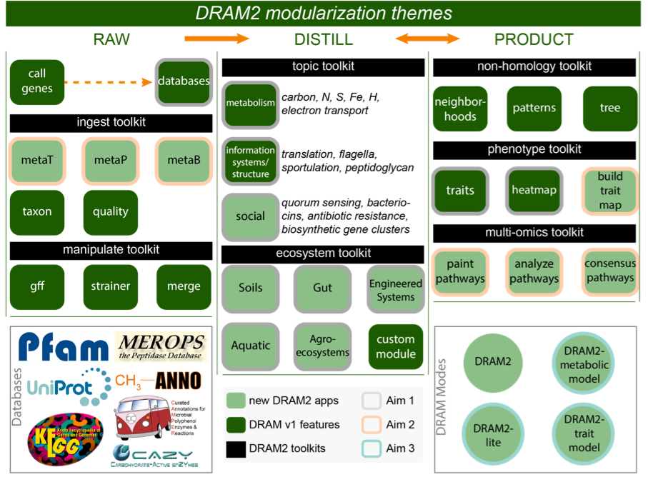

===================================
DRAM2 Visualization and Terminology
===================================

A DRAM2 terminology overview is necessary due to its complexity. This figure outlines some of this terminology and additional information is given below.

**DRAM2 Modules**
  * Raw 
  * Distill
  * Product

**DRAM2 toolkits**

*DRAM2 toolkits will be further described soon*

**DRAM2 Commands**

DRAM2 offers a wide variety of commands, each of which output results in a given module. DRAM2 commands may be a a *tool* in a toolkit or may be used to produce data within a given module.

For example: The ``dram2 call`` command is used to *ingest* raw sequencing data and generate called gene data.

A list of all DRAM2 commands can be accessed via the help menu:

.. code-block:: bash::

   dram2 --help

DRAM2 commands as listed in the help menu:

.. code-block:: bash::

   Commands:
     call              Call Genes and Filter FASTAs
     annotate          Annotate Genes with Gene Database
     list_dbs          List available databases
     list_db_sets      List available database sets
     pull_rrna         Pull rRNA Sequences With Barrnap (Not Ready)
     pull_trna         Pull tRNA Sequences With tRNAscan (Not Ready)
     distill           DRAM Distillate
     generate_genbank  Make A DRAM GenBank File (Not Ready)
     merge             Merge DRAM Projects (Gene calls and annotations only)
     strainer          Strain to Genes of Interest (Not Ready)
     neighbors         Pull Genes based on Their Neighborhoods (Not Ready)
     phylotree         Phylogenetic trees to DRAM
     adjectives        Describe Gene Features(Adjectives)
     build_db          Build Your Own Custom DRAM Database
     build_db_list     List the input files you can provied
