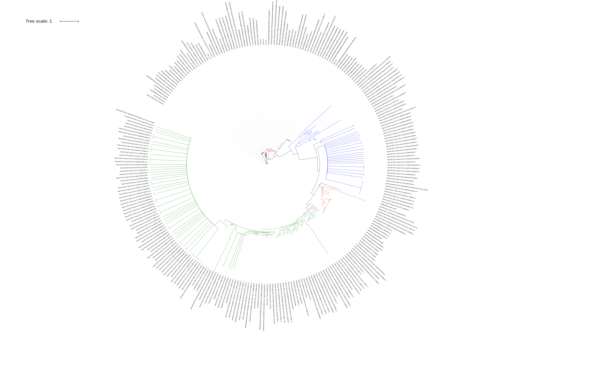
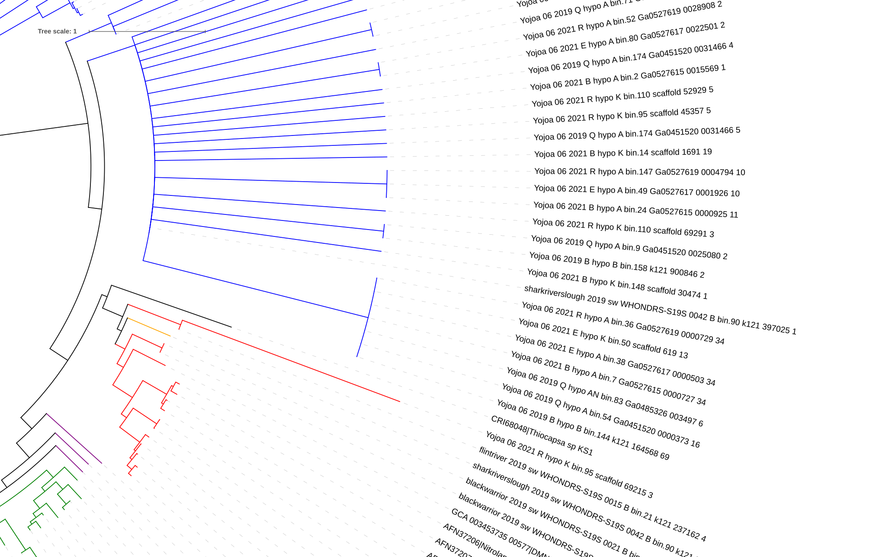

.. _phylo_trees-what_how:

What it is & How it Works
===========================

This tool impliments phylogentic trees in DRAM2 for the primary perpose of distiguashing between the functions of genes that are ambiguse, a term we use here to say that this gene could perform different functions in an oganisums, such that it canges the predicted metabolic capablities of the organism.

We use the phylogentic infomation about the genes in question deturmin the function on the genes that are ambiguse and thus disambiguate them. 

The work flow of this tool is summed up by the figure below, we will refrance this figure throughout this documentation so you may want to take note of it now:

.. _phylo_trees-what_how-fig:

Phylo Tree Workflow
--------------

.. raw:: html

   

  

Ambiguase gene
---------------

Note above that this tool requiers that the user run the DRAM2 raw annotation step first, this step is key to the adjectivs script which this process feads into, but its primary perpose in this tool is to provide the annotations that can then be used to decide if a gene is ambiguse. For a simple example if a gene was annotated by KOfam with a KO that mapped to NarNax then DRAM2 would mark that gene for disambiguateion

**note to self: check the use of the language and the discription of narnax**
**note to self: if exampes get over long move to exampes**

Where do Trees Come from
---------------

Exploration found that Pplacer is sufficient for the purpose of adding nodes to the tree. Other tools do exist but do not have sufficient speed to warrant replacing Pplacer which has maintained development, is well respected, and has no obvious inadequacy.

A full 

Placing Based on Clade
---------------

Placing Based on Distace
---------------

What is EDPL
---------------

.. image:: ../figs/EDPL.png

How can I see The Placemens
________________

data for ITol is produced in the form in phyloxml format with colors pre-applied. However, we will want to have a visual of placement information that is informative, and ITol will create extra steps and lacs some flexablility.
